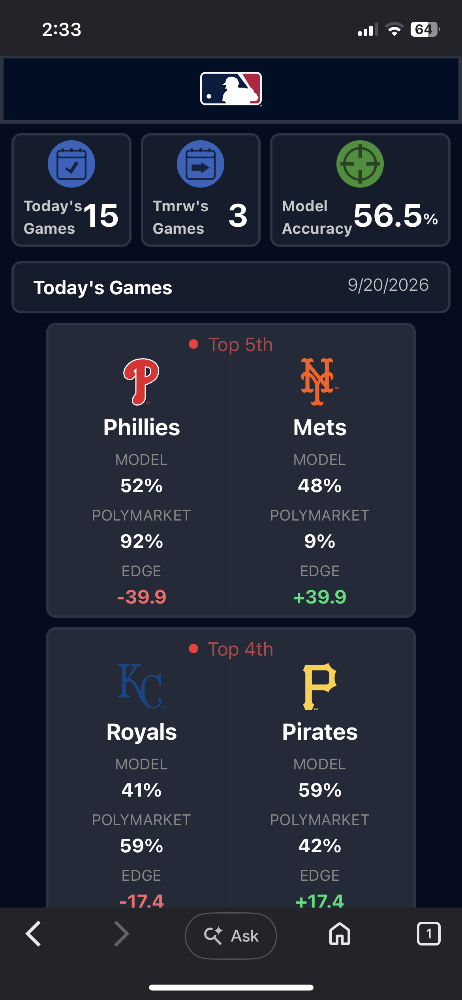

# MLB Win Probability Model vs. Polymarket

A full-stack machine learning application that predicts the winner of upcoming MLB games and compares those predictions side-by-side with live odds from [Polymarket](https://polymarket.com), a peer-to-peer prediction market.



## Project Goal

The question driving this project: **can a model built from public baseball data find an edge over the market's opinion of who wins?**

Polymarket prices each MLB moneyline market based on the aggregate belief of everyone trading it. That crowd price is a strong benchmark — it absorbs injury news, lineup changes, and sharp money. Rather than just training a classifier and reporting accuracy in a vacuum, this project puts the model's win probability next to the market's implied probability for the same game and surfaces the gap between them as an **edge** number.

That framing makes the result honest either way. If the model consistently disagrees with the market and turns out to be right, that's a real edge. If the market wins, that's a meaningful finding too — it says the features aren't carrying information the crowd doesn't already have.

This is a personal research project, not a production trading system.

## How It Works

```
[Polymarket API] ──live fetch on request──┐
                                          ├──> FastAPI (/api/games) ──> React frontend
[MLB stats] ──daily retrain──> model.pkl ─┘
```

The design separates expensive work from the request path:

- **Scheduled work** — a daily job pulls the previous day's completed games, rebuilds the feature set, retrains the model, and writes it to disk.
- **Request path** — `/api/games` loads the already-trained model, generates predictions for upcoming games, fetches live Polymarket odds, and returns both together along with the model's current accuracy.


## Tech Stack

| Layer          | Tech                                                    |
| -------------- | ------------------------------------------------------- |
| Frontend       | React, Vite, Tailwind CSS                                |
| Backend        | FastAPI, uvicorn                                         |
| ML             | scikit-learn, pandas, NumPy, joblib                      |
| Scheduling     | APScheduler (in-process daily job)                       |
| Data sources   | MLB game and pitcher stats; Polymarket API for live odds |
| Remote access  | Tailscale (private network, no public exposure)          |

In development, Vite proxies `/api/*` to the FastAPI backend, so the frontend uses one relative URL that works identically in dev and behind nginx in production — no CORS config, no hardcoded backend host.

## The Machine Learning

### Algorithm

**Regularized logistic regression** (scikit-learn `LogisticRegression` / `LogisticRegressionCV`), trained as a binary classifier on whether the home team wins.

Logistic regression was chosen deliberately over gradient boosting. Single-game baseball outcomes are a low signal-to-noise problem with a limited number of training rows per season, and in that regime a linear model with L2 regularization tends to match tree ensembles while producing better-calibrated probabilities out of the box. Calibration matters more here than raw accuracy: the entire project depends on comparing the model's probability to a market price, so a model that ranks games well but outputs miscalibrated probabilities is useless for finding edge. A `RandomForestClassifier` was evaluated as a comparison baseline.

### Features

Built from team-level and starting-pitcher data:

- **Season-to-date team stats** — aggregate offensive and pitching rates
- **Rolling last-10 form** — recent performance, which captures current roster state better than season aggregates
- **Bullpen fatigue** — relief innings thrown over the previous 3 days
- **Starting pitcher stats** — merged in from a separate pitcher pipeline, since the starter is roughly half the predictable signal in any single game

### Validation

Training uses a **chronological split** rather than a random one — the data is sorted by date and split at the 80% mark, so the model is never trained on games that happened after the ones it's tested on. Random k-fold would leak future information backward and inflate the reported numbers.

Metrics tracked: accuracy and ROC AUC.

> **Current performance:** 
Accuracy- 0.5651
AUC- 0.5852
Baseline- 0.5284


## Project Structure

```
.
├── frontend/                          # React + Vite app
│   ├── src/
│   │   ├── hooks/useGames.js          # fetches /api/games
│   │   └── pages/                     # game cards, model vs market, edge display
│   └── vite.config.js                 # dev proxy to backend
├── backend/
│   ├── main.py                        # FastAPI app, /api/games endpoint
│   └── Machine_Learning_Pipeline/
│       ├── team_data_pipeline.py      # team-level training data
│       ├── pitcher_pipeline.py        # starting pitcher features
│       ├── train.py                   # model training + evaluation
│       └── predict_pipeline.py        # predictions for upcoming games
├── data/                              # raw daily stats + model.pkl (mounted volume)
└── README.md
```

## Running Locally

```bash
# Backend
cd backend
pip install -r requirements.txt
uvicorn main:app --reload

# Frontend
cd frontend
npm install
npm run dev
```

## Roadmap

Features planned for future versions:

- **Live in-game predictions** — update win probability as the game progresses, using score, inning, base-out state, and bullpen usage. This turns the comparison with Polymarket into a continuous one, since market prices move throughout the game and in-game mispricings tend to be larger than pregame ones.
- **Additional sports, starting with the NFL** — the pipeline structure (fetch stats → build features → retrain → compare to market) is sport-agnostic. NFL is the natural next target given the market liquidity, though the much smaller number of games per season makes it a harder modeling problem.
- **Historical odds logging** — record Polymarket prices daily alongside predictions to build the dataset needed for a proper backtest. This history can't be backfilled, so it needs to start early.
- **ROI backtesting** — measure profitability against the market rather than raw accuracy. A model can beat 54% and still lose money.
- **Probability calibration** — isotonic or Platt scaling on a held-out chronological slice, with a reliability curve.
- **Market price as a feature** — test directly whether the model adds information on top of the line, or just reproduces it.
- **Test coverage** — pytest cases around feature engineering and prediction logic, where upstream schema changes are most likely to break things silently.
